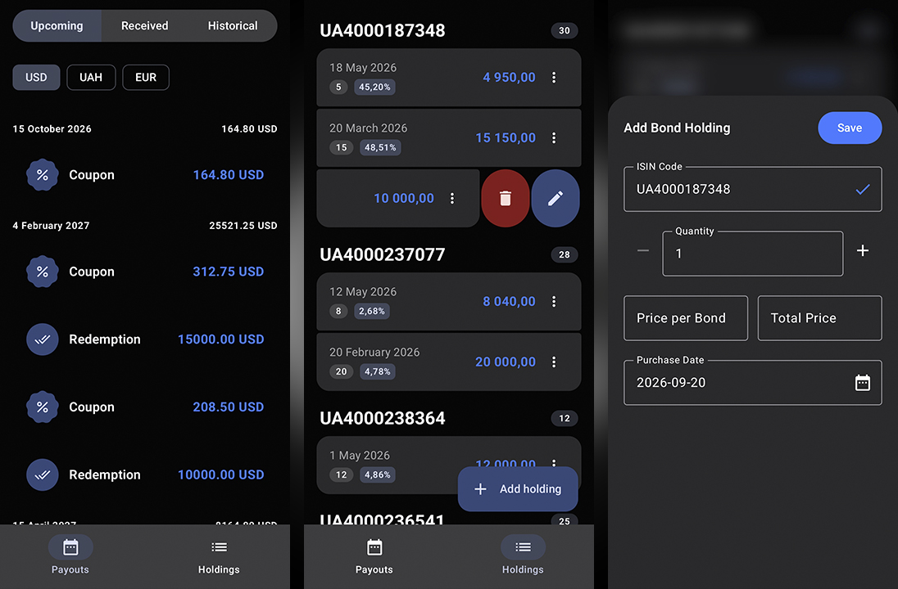

# Lynd

Lynd is an open-source Android application to track Ukrainian domestic government bonds (OVDP).
The application helps individual investors monitor their bond portfolio and forecast cash flows.



## Features

- **Bond Catalog Sync**: The app downloads official bond specifications from the National Bank of Ukraine (NBU) Depository API.
- **Portfolio Tracking**: You can log purchases with custom quantities, purchase dates, and total paid prices.
- **Payout Timeline**: The app calculates and displays coupon payments and principal redemptions in chronological order.
- **Offline Storage**: Room database stores all data locally on your device for fast offline access.
- **Precise Financial Math**: The application uses `BigDecimal` and `LocalDate` to prevent rounding errors.

## Tech Stack

- **Language**: [Kotlin](https://kotlinlang.org/)
- **UI Framework**: [Jetpack Compose](https://developer.android.com/jetpack/compose) with Material 3
- **Local Database**: [Room](https://developer.android.com/training/data-storage/room)
- **Networking**: [Retrofit](https://github.com/square/retrofit) with [Kotlinx Serialization](https://github.com/Kotlin/kotlinx.serialization)
- **Asynchronous Work**: Kotlin Coroutines and StateFlow

## Architecture

The project follows the official Android architecture guidelines:
- MVVM (Model-View-ViewModel) pattern
- Unidirectional Data Flow (UDF)
- Repository pattern for data operations

## Prerequisites

To build and run the project, ensure you have:
- Android Studio Ladybug (2024.2) or newer
- JDK 17 or Android Studio JetBrains Runtime (JBR)
- Android SDK with API 35+ installed (compileSdk 37, minSdk 24)

## Building and Testing

1. Clone the repository:
   ```bash
   git clone https://github.com/adnlv/lynd-android.git
   ```

2. Open the project in Android Studio.

3. Run unit tests:
   ```bash
   ./gradlew testDebugUnitTest
   ```

4. Assemble the debug APK:
   ```bash
   ./gradlew assembleDebug
   ```

## Data Source

The application retrieves public bond data from the official National Bank of Ukraine Depository API:
`https://bank.gov.ua/depo_securities?json`

## Disclaimer

This application is an informational tool. It does not provide financial or investment advice.

## License

This project is licensed under the GNU General Public License v3.0. See the [LICENSE](LICENSE) file for details.
